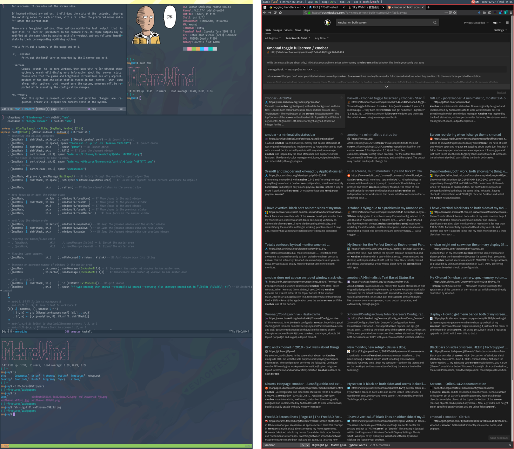

= Xmonad Config

Simple Xmonad configuration, intended for a dual-portrait monitor setup.

== Usage

This setup depends on the following utilities:

- https://github.com/jaor/xmobar[Xmobar]
- https://sw.kovidgoyal.net/kitty/[Kitty]
- https://tools.suckless.org/dmenu/[Dmenu]
- https://github.com/naelstrof/maim[Maim], a screenshot utility. Scrot
  has some problems with compositing in X11.
- https://github.com/google/xsecurelock[XSecureLock]

The build script reads `xmonad.hs` and all files that match
`xmonad-*.hs`, and concat them together to form the source code of
Xmonad. The latter are mean to store personal settings that are not
suitable in a public Git repository.
